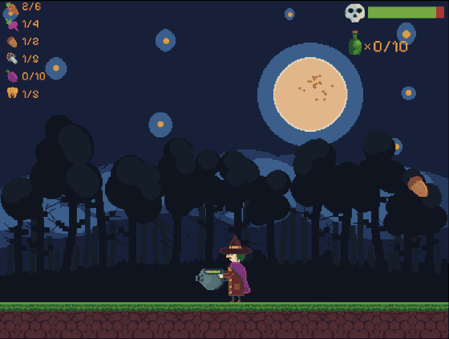

# Casual game Witch

Dear friends, immerse yourselves in the world of a witch, gather ingredients, and brew potions. This is a simple, lighthearted game I created for fun and to explore the Kaboom.js library. Enjoy playing and sharpen your focus as you go!
[PLAY](https://blackbird-dev.itch.io/witch)



Folder structure

- `src` - source code for your kaboom project
- `www` - distribution folder, contains your index.html, built js bundle and static assets
- screenshot -  picture of the game

Development

```sh
$ npm run dev
```

will start a dev server at

```
http://localhost:8000
```

Distribution

```sh
$ npm run build
```

will build your js files into `www/main.js`

```sh
$ npm run bundle
```

will build your game and package into a .zip file, you can upload to your server or itch.io / newground etc.


P.S. You might notice some messy code, as this is mainly a learning project and an introduction to the Kaboom.js library.
